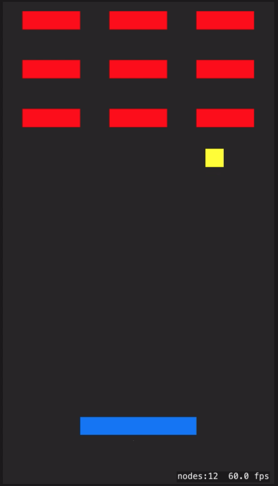

## Game

*ブロック崩しアプリ*  
*ゲームアプリ開発の難しさとレベルの違いを痛感*

1. 概要

    - お決まりのブロック崩しゲーム
    - ゲームオーバーから3秒後に再開

1. 環境

    - Xcode 10.1
    - Swift 4.2.1
    - Man-hour 4.0h

1. 学び / ポイント

    - ゲームアプリの作り方 / SpriteKit, GameplayKit

1. イメージ

    |                          Screen1                           |
    |------------------------------------------------------------|
    |  |

1. ソースコード

    [GitHub](https://github.com/nsuhara/swift-Game.git)
